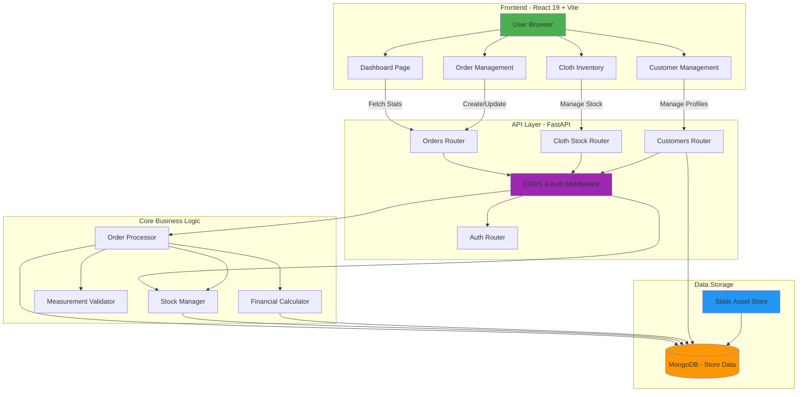
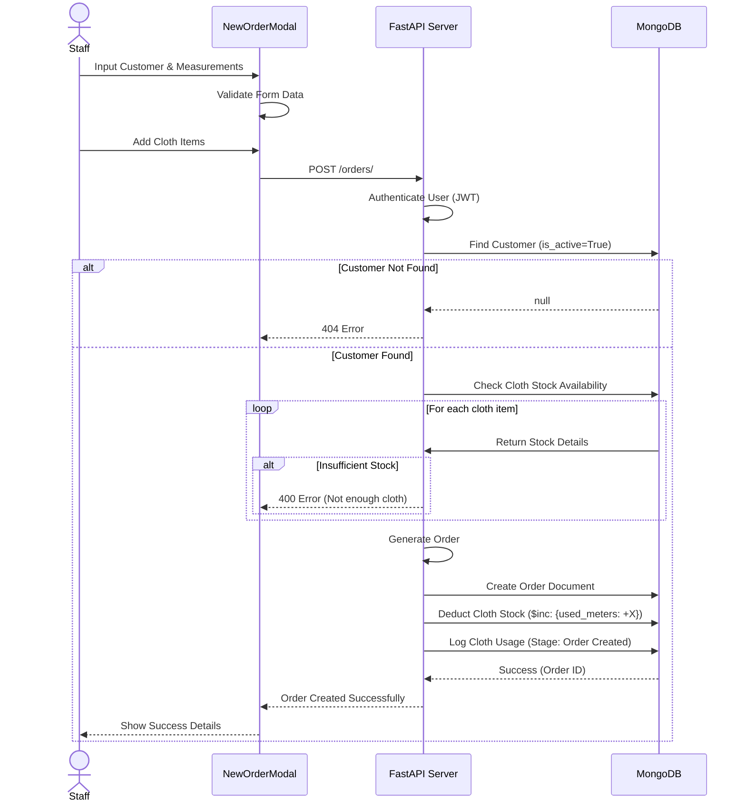
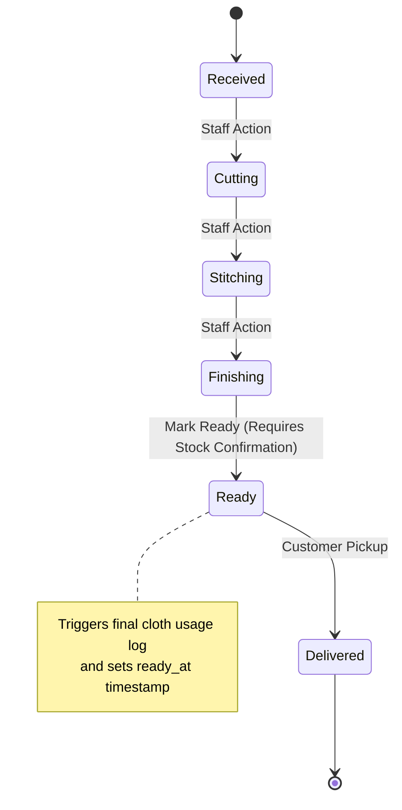
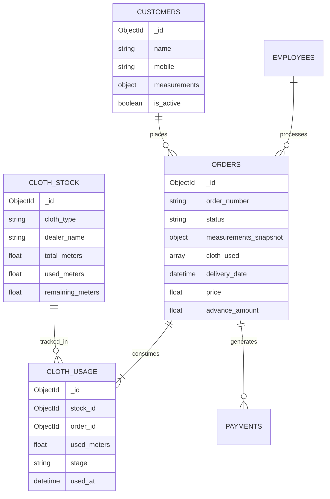
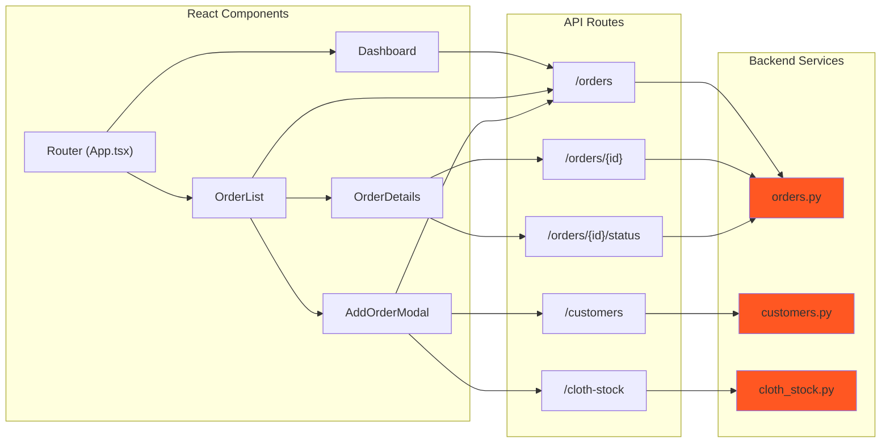
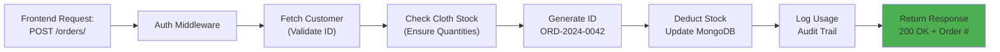
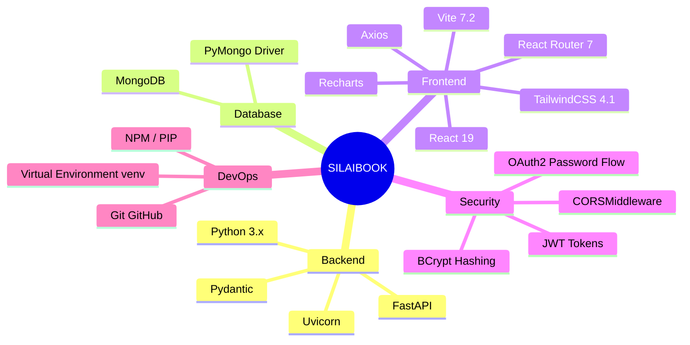
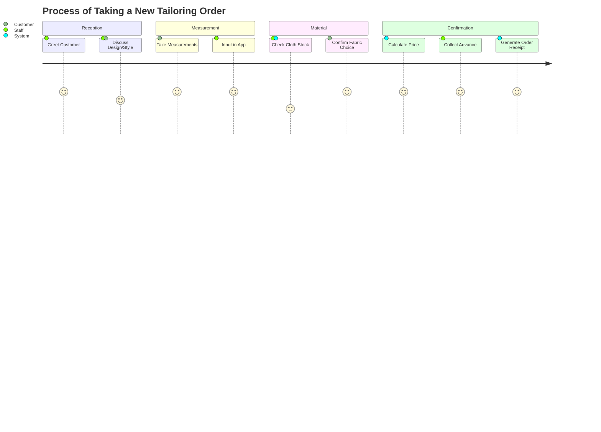
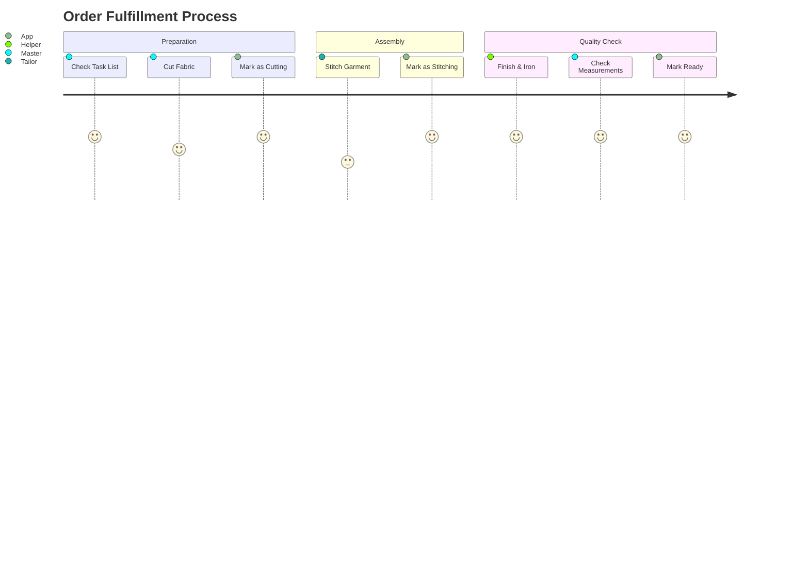
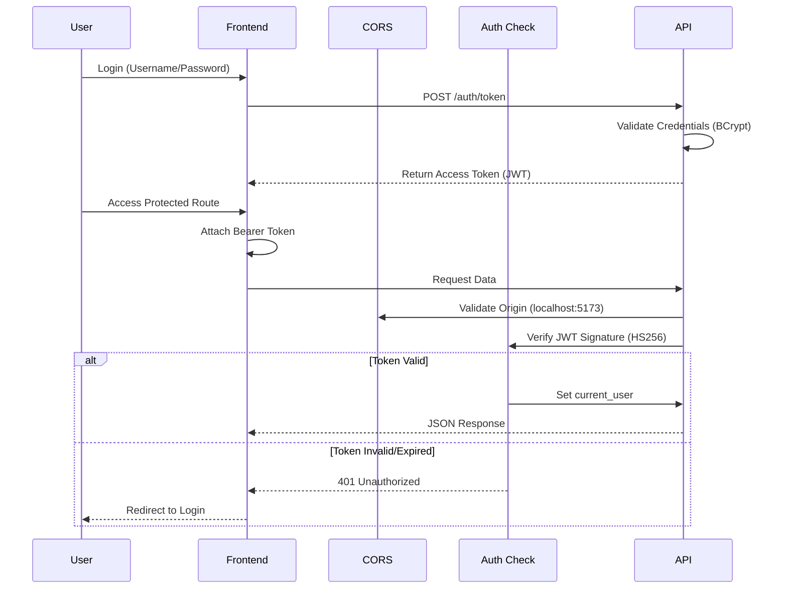

# SILAIBOOK - Visual Project Workflow

This document provides comprehensive visual diagrams showcasing how the **SilaiBook** tailoring shop management system works end-to-end.

---

## 🏗️ System Architecture Overview

---

## 🧵 Order Creation Flow - Detailed

---

## 🔄 Order Lifecycle & Status Workflow

---

## 🗄️ Data Models & Relationships

---

## 🎯 Component Interaction Map

---

## ⚡ Request/Response Flow Examples

### Example 1: Creating an Order

### Example 2: Marking Order as Ready

---

## 📊 Technology Stack

---

## 🎨 User Journey Map

### Customer/Staff Journey: Placing a Custom Order

### Staff Journey: Order Production

---

## 🔐 Security & Authentication Flow

---

